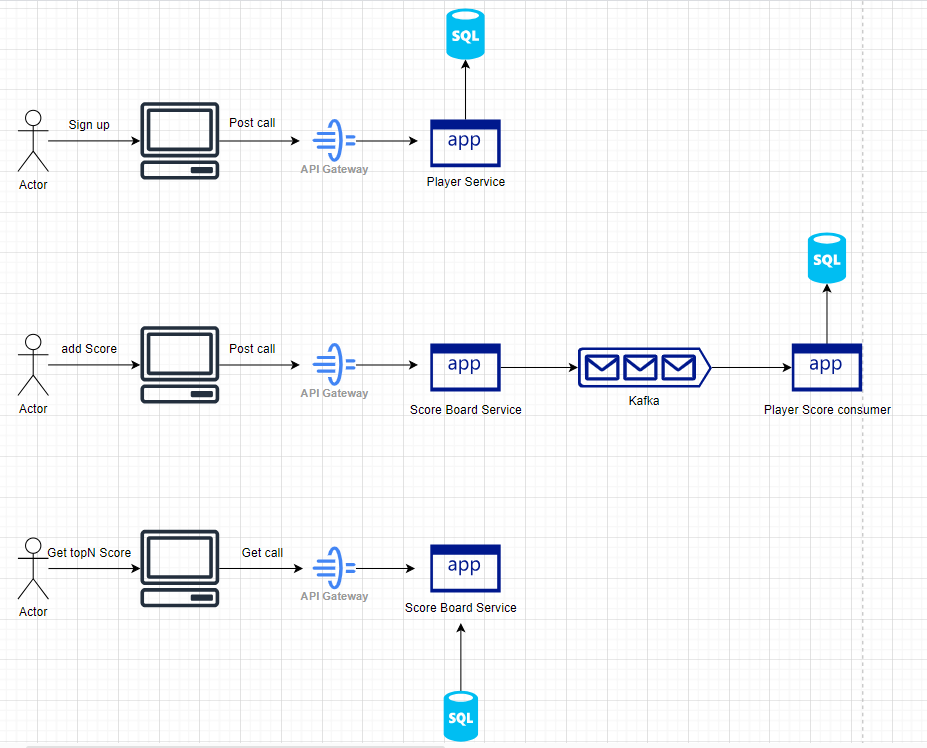

# Gaming ScoreBoard Service

## Problem Statement

You are part of a team, building a gaming service. You are responsible for implementing the module that
keeps track of the all time top scores. As players complete a game, the game service will publish the
player’s score.

### Table of contents:

- [Detailed Approach](#detailed-approach)
- [DB Schema](#db-schema)
- [API Contracts](#api-contracts)
- [Local Development](#local-development)
- [Testing](#testing)


## Detailed Approach



`Gaming-ScoreBoard-Service` consumes events from `Kafka` and stores the data in `H-2 SQL DB`.
we fetch the player's score from the DB and return the top N scorers with their names using Heap Data Structure.
### Core Logic Time Complexity - 
Considering total n scores in database and we need to fetch k top scores:

```
O(n) + O(n logk )
~O(n) [k is Constant]
```


| Dimension   | Salient Points                                                       |
|-------------|----------------------------------------------------------------------|
| Cost        | + Cheap at scale                                                     |
| Complexity  | ~ Low/Medium complexity                                              |
| Scalability | + Highly scalable and can serve huge amounts of reads at low latency |
| Performance | + High throughput since no complex DB query and locks required       |


## DB Schema


## API Contracts

### POST : /player/signUp

#### Request
```shell
curl --location 'http://localhost:8080/player/signUp' \
--header 'Content-Type: application/json' \
--data '{
    "playerName":"Surabhi",
    "contact":"917011567594",
    "age":"25"
}'
```
#### Response

_**Sample Response**_

Status Code :- 200 (OK)
```json
{
  "httpStatus": "CREATED",
  "data": {
    "id": 1,
    "playerName": "Surabhi",
    "contact": "917011567594",
    "age": 25
  },
  "message": "Created",
  "timestamp": 1720641563467
}
```

Status Code : 4xx/5xx
```json
{
  "httpStatus": "CONFLICT",
  "data": null,
  "message": "Player with same contact details is already registered in the system",
  "timestamp": 1720641710850
}
```

```json
{
  "httpStatus": "INTERNAL_SERVER_ERROR",
  "data": null,
  "message": "Internal Server Error",
  "timestamp": 1720641782109
}
```

```json
{
  "httpStatus": "BAD_REQUEST",
  "data": null,
  "message": "Contact number which you have provided is not valid",
  "timestamp": 1720641742050
}
```

### POST : /score/addScore

#### Request
```shell
curl --location 'http://localhost:8080/score/addScore' \
--header 'Content-Type: application/json' \
--data '{
    "playerId":"1",
    "score":"21"
}'
```
#### Response

_**Sample Response**_

Status Code :- 200 (OK)
```json
{
  "httpStatus": "OK",
  "data": {
    "id": null,
    "playerId": 1,
    "score": 21
  },
  "message": "OK",
  "timestamp": 1720642015325
}
```

### GET : /score/getTopScorers?top=

#### Request
```shell
curl --location 'http://localhost:8080/score/getTopScorers?top=5'
```
#### Response

_**Sample Response**_

Status Code :- 200 (OK)
```list
[
  {
    "playerName": "Surabhi",
    "score": 21
  },
  {
    "playerName": "Pranav",
    "score": 30
  },
  {
    "playerName": "kajal",
    "score": 50
  },
  {
    "playerName": "Ankit",
    "score": 50
  },
  {
    "playerName": "Anshuman",
    "score": 60
  }
]
```


## Local Development

1. Clone the repo
2. Install all dependencies ( Make sure java and Kafka are setup already )
3. Run `.\bin\windows\zookeeper-server-start.bat .\config\zookeeper.properties` from dir where Kafka is installed
4. Run `.\bin\windows\kafka-server-start.bat .\config\server.properties` from dir where Kafka is installed
5. This will start your kafka at `localhost:9092`
6. If you run into any error - recheck your environment variables for JAVA_HOME and clean the logs file of Kafka and retry.
7. Run the file [GamingScoreBoardApplication.java](src/main/java/com/intuit/gaming/GamingScoreBoardApplication.java).
8. This will start the Tomcat server at `localhost:8080`
9. You can access the H2 SQL server at http://localhost:8080/h2-console. Refer [application.properties](src/main/resources/application.properties).


### Testing
1. Follow the above steps for Local Development.
2. You can use Postman to test the apis
3. Or you can trigger integration tests to verify.

